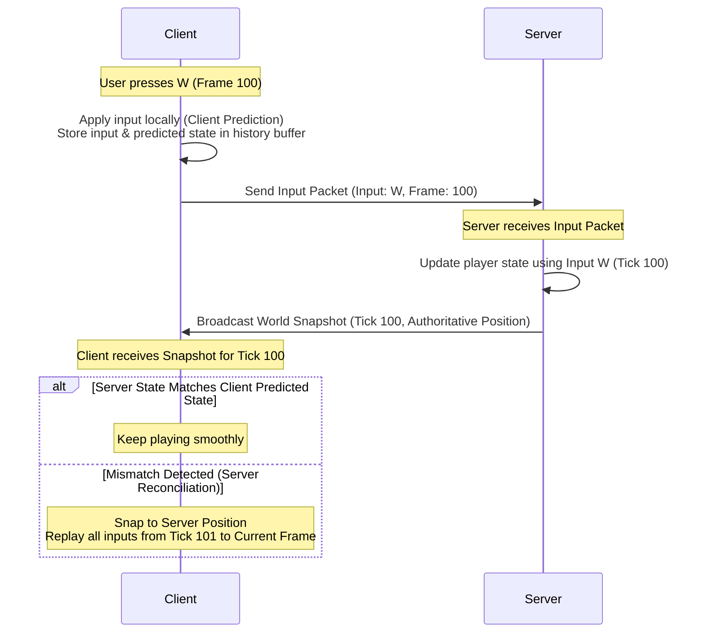
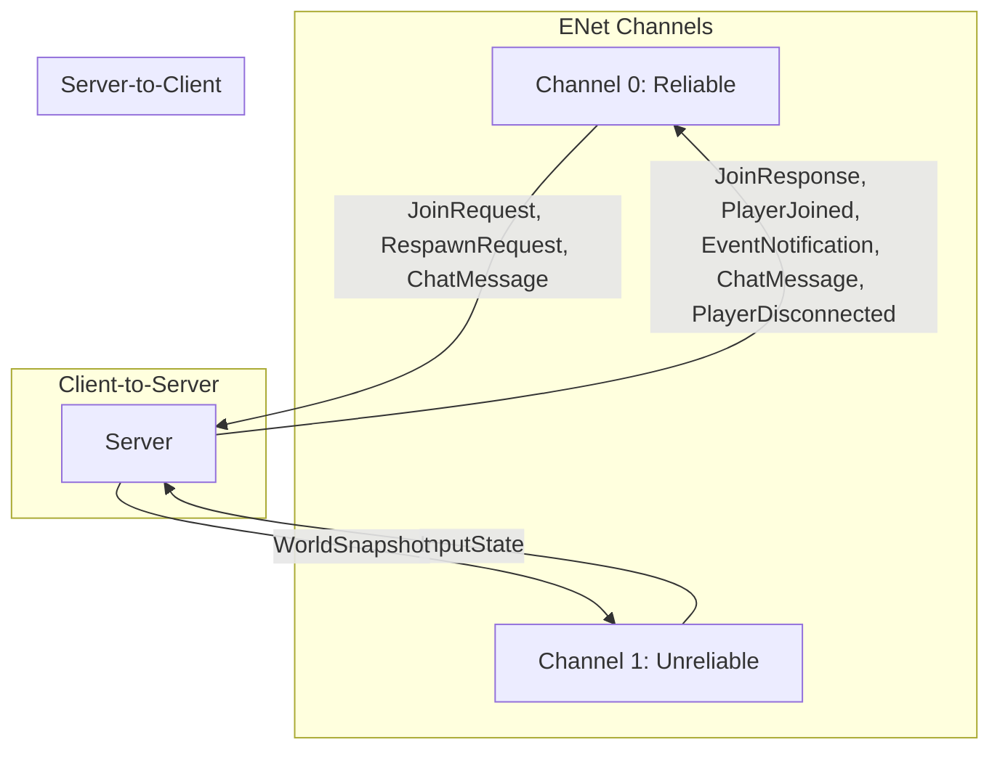

# PewPewBoomBoom - 2D Top-Down Multiplayer Tank Combat Game

Welcome to the development repository for **PewPewBoomBoom**, a 2D top-down multiplayer tank combat game built with C++, **raylib** for rendering/audio, and **ENet** for reliable/unreliable UDP network communication. 

This document serves as both the **Game Design Document (GDD)** and the **Step-by-Step Implementation Plan** to guide development from start to a polished release supporting up to 32 players over the network.

---

## Table of Contents
1. [Game Design Document (GDD)](#1-game-design-document-gdd)
   - [Core Gameplay Mechanics](#core-gameplay-mechanics)
   - [Weapons & Powerups](#weapons--powerups)
   - [Arena & Environment](#arena--environment)
   - [Technical Architecture](#technical-architecture)
   - [Network Synchronization Model](#network-synchronization-model)
   - [Network Protocol & Message Specification](#network-protocol--message-specification)
2. [Project Architecture](#2-project-architecture)
   - [Shared Library (sharedLib)](#shared-library-sharedlib)
   - [Server Component (server)](#server-component-server)
   - [Client Component (client)](#client-component-client)
3. [Implementation Plan (Roadmap)](#3-implementation-plan-roadmap)
   - [Phase 1: Setup & Networking Foundations](#phase-1-setup--networking-foundations)
   - [Phase 2: Network Protocol & Shared Data Structures](#phase-2-network-protocol--shared-data-structures)
   - [Phase 3: Fixed-Tick Server Simulation & Client Skeleton](#phase-3-fixed-tick-server-simulation--client-skeleton)
   - [Phase 4: Player Input Replication, Prediction, and Reconciliation](#phase-4-player-input-replication-prediction-and-reconciliation)
   - [Phase 5: Collision Detection & Map Obstacles](#phase-5-collision-detection--map-obstacles)
   - [Phase 6: Combat System, Bullets, & Damage](#phase-6-combat-system-bullets--damage)
   - [Phase 7: Weapons & Powerups Sandbox](#phase-7-weapons--powerups-sandbox)
   - [Phase 8: HUD, UI, Audio, & Visual Polish](#phase-8-hud-ui-audio--visual-polish)
   - [Phase 9: Stress Testing, Optimization, & Lag Simulation](#phase-9-stress-testing-optimization--lag-simulation)
4. [Development Milestones & Success Criteria](#4-development-milestones--success-criteria)
5. [Recommended Prompts and Tasks](#5-recommended-prompts-and-tasks)
6. [Implementation Notes](#6-implementation-notes)
   - [Handling Variable-Sized Packets (PacketProcessor Architecture)](#handling-variable-sized-packets-packetprocessor-architecture)
35: 
36: ---

## 1. Game Design Document (GDD)

### Core Gameplay Mechanics
- **Player Representation**: Every player controls a tank composed of two sprites: a **Chassis** (base) and a **Turret**.
- **Movement (WASD)**: 
  - Tank moves forward/backward relative to its chassis orientation (`W`/`S`).
  - Tank rotates left/right (`A`/`D`) to change the chassis orientation.
  - Movement is governed by physics constants: acceleration, max speed, and friction/drag.
- **Aiming (Mouse)**: The turret rotates independently to face the screen cursor, allowing players to drive in one direction while shooting in another.
- **Shooting (Left Mouse Button)**: Fires the currently active weapon in the direction of the turret's rotation.
- **Player Limit**: Up to 32 players concurrently on a single server instance.

### Weapons & Powerups

| Weapon Type | Ammo | Cooldown | Velocity | Behavior |
| :--- | :--- | :--- | :--- | :--- |
| **Standard Cannon** | Infinite | 0.35s | Fast | Moderate damage, straight projectile trajectory. |
| **Rapid-Fire MG** | 100 max | 0.08s | High | Low damage per round, slight spread, high fire rate. |
| **Heavy Rocket** | 5 max | 1.20s | Slow | High damage, explodes on contact dealing AoE damage. |
| **Laser Railgun** | 3 max | 1.80s | Instant | Hitscan line trace, penetrates enemies, high damage. |

| Powerup Type | Spawn Rate | Duration | Behavior |
| :--- | :--- | :--- | :--- |
| **Health Repair** | High | Instant | Restores 50% of the tank's maximum health. |
| **Speed Boost** | Medium | 8.0s | Increases chassis acceleration and max speed by 50%. |
| **Shield Generator**| Low | 5.0s | Grants total damage immunity; visual shield bubble active. |
| **Weapon Crates** | Medium | N/A | Refills ammo for special weapons or equips them. |

### Arena & Environment
- **Top-Down Map Layout**: The arena is bounded by outer walls and filled with obstacles.
- **Obstacle Categories**:
  - **Indestructible Blocks**: Solid walls (concrete/metal) that reflect projectiles or absorb damage. Blocks both movement and bullets.
  - **Destructible Blocks**: Crates or brick walls that crumble after taking a specific amount of cumulative damage, revealing new paths or powerups.
  - **Bushes/Cover**: Visual-only overlays that hide tanks inside them from players outside (line-of-sight visual mechanics).
- **Spawn Zones**: Multiple spawn points spread across the arena to prevent spawn camping.

---

### Technical Architecture
The codebase is structured as a multi-project workspace managed by **Premake5**:
1. **`sharedLib`**: Houses packet definitions, math functions, collision detection logic, and state definitions. This shared library compiles as a static library and is linked by both the server and client.
2. **`server`**: A headless C++ application hosting the authoritative game simulation. It processes network inputs and distributes game states.
3. **`client`**: A graphical C++ application using **raylib** to render the game world, accept local player inputs, play audio, and represent the UI/menus.

### Network Synchronization Model
A server-authoritative simulation is used to prevent cheating and maintain a singular source of truth. However, relying purely on server responses creates a laggy experience for clients. The following techniques will be implemented:



1. **Client-Side Prediction**: The local player moves immediately in response to their keyboard input, without waiting for the server to reply.
2. **Server Reconciliation**: The server constantly broadcasts authoritative positions. The client stores a history buffer of sent inputs and predicted states. When a server update arrives, the client compares the historical state with the server's authoritative state. If they differ, the client snaps to the server's state and replays the inputs stored in the buffer up to the current tick.
3. **Entity Interpolation**: Other tanks and projectiles are not predicted. Instead, the client buffers incoming server snapshots (typically 100ms behind the real-time tick) and interpolates their positions smoothly between the two most recently received ticks to prevent jittering.
4. **Lag Compensation (Hit Registration)**: The server keeps a short history of player hitboxes. When a player fires a hitscan weapon (like the Laser Railgun), the client sends the tick number when they fired. The server rewinds the world to that tick to evaluate if the laser hit the target, neutralizing latency disadvantages for high-ping players.

### Network Protocol & Message Specification

To implement real-time tank battles with up to 32 players, **PewPewBoomBoom** uses a structured binary protocol over **ENet**. This protocol minimizes bandwidth overhead and aligns variables to prevent platform padding issues.

#### ENet Channel Configurations
* **Channel 0 (Reliable)**: Used for critical, non-frequent state updates and handshakes (connections, leaves, combat events, chat). Message delivery is guaranteed and ordered.
* **Channel 1 (Unreliable)**: Used for high-frequency game states (player inputs, world snapshots). Lost packets are discarded, avoiding head-of-line blocking.



#### Common Packet Header
All network packets begin with a single byte indicating the packet type:
* **Byte Offset 0**: `PacketType` (1 byte, unsigned integer)

---

#### 1. Client-to-Server (C2S) Messages

##### C2S_JoinRequest (Channel 0 - Reliable)
Sent by a client attempting to connect and register with the server.

| Field | Data Type | Bytes | Description |
| :--- | :--- | :--- | :--- |
| **PacketType** | `uint8_t` | 1 | Set to `PacketType::C2S_JoinRequest` (value: 0) |
| **ProtocolVersion** | `uint32_t` | 4 | Protocol version hash to check compatibility. |
| **PlayerName** | `char[16]` | 16 | Null-terminated UTF-8 string containing the user's nickname. |

##### C2S_InputState (Channel 1 - Unreliable)
Sent every frame/tick (60Hz) by clients to drive the player's tank.

| Field | Data Type | Bytes | Description |
| :--- | :--- | :--- | :--- |
| **PacketType** | `uint8_t` | 1 | Set to `PacketType::C2S_InputState` (value: 2) |
| **ClientTick** | `uint32_t` | 4 | The local tick number when this input was generated. |
| **InputMask** | `uint8_t` | 1 | Bitfield for keys: `W` (bit 0), `S` (bit 1), `A` (bit 2), `D` (bit 3), `Shoot` (bit 4). |
| **TurretAngle** | `float` | 4 | Current angle of the turret in radians (0 to $2\pi$). |
| **SelectedWeapon**| `uint8_t` | 1 | Numeric ID of the weapon slots currently active. |

##### C2S_ChatMessage (Channel 0 - Reliable)
Sent by a player to broadcast text in the lobby or in-game chat.

| Field | Data Type | Bytes | Description |
| :--- | :--- | :--- | :--- |
| **PacketType** | `uint8_t` | 1 | Set to `PacketType::C2S_ChatMessage` (value: 8) |
| **MessageText** | `char[128]` | 128 | Null-terminated UTF-8 encoded message text. |

##### C2S_RespawnRequest (Channel 0 - Reliable)
Sent by a dead client to request respawning in the game.

| Field | Data Type | Bytes | Description |
| :--- | :--- | :--- | :--- |
| **PacketType** | `uint8_t` | 1 | Set to `PacketType::C2S_RespawnRequest` (value: 10) |

---

#### 2. Server-to-Client (S2C) Messages

##### S2C_JoinResponse (Channel 0 - Reliable)
Server response containing authorization status, assigned ID, and general map constants.

| Field | Data Type | Bytes | Description |
| :--- | :--- | :--- | :--- |
| **PacketType** | `uint8_t` | 1 | Set to `PacketType::S2C_JoinResponse` (value: 1) |
| **ResponseCode** | `uint8_t` | 1 | `0`: Success, `1`: Server Full, `2`: Version Mismatch. |
| **AssignedID** | `uint8_t` | 1 | Unique network ID (0-31) representing the client's tank. |
| **SpawnX** | `float` | 4 | Initial coordinate X on spawning. |
| **SpawnY** | `float` | 4 | Initial coordinate Y on spawning. |

##### S2C_SetWorldInfo (Channel 1 - Reliable)
Broadcast at 60Hz from the server to establish the current tick's frame information and entity counts.

| Field | Data Type | Bytes | Description |
| :--- | :--- | :--- | :--- |
| **PacketType** | `uint8_t` | 1 | Set to `PacketType::S2C_WorldSnapshotHeader` (value: 3) |
| **ServerTick** | `uint32_t` | 4 | Authoritative server tick count. |
| **LastAckedTick** | `uint32_t` | 4 | The last client tick processed by the server (for reconciliation). |
| **PlayerCount** | `uint8_t` | 1 | Total active players. Client expects this many player update packets. |
| **BulletCount** | `uint16_t` | 2 | Total active bullets. Client expects this many bullet update packets. |
| **PowerupCount** | `uint8_t` | 1 | Total active powerups. Client expects this many powerup update packets. |

##### S2C_PlayerSnapshot (Channel 1 - Unreliable)
Sent for each active player.

| Field | Data Type | Bytes | Description |
| :--- | :--- | :--- | :--- |
| **PacketType** | `uint8_t` | 1 | Set to `PacketType::S2C_PlayerSnapshot` (value: 4) |
| **ServerTick** | `uint32_t` | 4 | Server tick associated with this player state. |
| **State** | `PlayerNetState` | 23 | Player position and status structure (see below). |

##### S2C_BulletSnapshot (Channel 1 - Unreliable)
Sent for each active bullet.

| Field | Data Type | Bytes | Description |
| :--- | :--- | :--- | :--- |
| **PacketType** | `uint8_t` | 1 | Set to `PacketType::S2C_BulletSnapshot` (value: 5) |
| **ServerTick** | `uint32_t` | 4 | Server tick associated with this bullet state. |
| **State** | `BulletNetState` | 13 | Bullet position and status structure (see below). |

##### S2C_PowerupSnapshot (Channel 1 - Unreliable)
Sent for each active powerup.

| Field | Data Type | Bytes | Description |
| :--- | :--- | :--- | :--- |
| **PacketType** | `uint8_t` | 1 | Set to `PacketType::S2C_PowerupSnapshot` (value: 6) |
| **ServerTick** | `uint32_t` | 4 | Server tick associated with this powerup state. |
| **State** | `PowerupNetState` | 10 | Powerup position and status structure (see below). |

##### S2C_EventNotification (Channel 0 - Reliable)
Sent when high-impact game events occur that require perfect delivery.

| Field | Data Type | Bytes | Description |
| :--- | :--- | :--- | :--- |
| **PacketType** | `uint8_t` | 1 | Set to `PacketType::S2C_EventNotification` (value: 7) |
| **EventType** | `uint8_t` | 1 | Event: `0` (Damage Taken), `1` (Kill Event), `2` (Powerup Collected), `3` (Match Finished). |
| **SourceID** | `uint8_t` | 1 | Player/entity ID that initiated the event. |
| **TargetID** | `uint8_t` | 1 | Player/entity ID affected by the event. |
| **EventValue** | `float` | 4 | Payload variable (e.g., damage amount, weapon ammo type). |

##### S2C_PlayerDisconnected (Channel 0 - Reliable)
Broadcast when a peer disconnects to clean up the client state immediately.

| Field | Data Type | Bytes | Description |
| :--- | :--- | :--- | :--- |
| **PacketType** | `uint8_t` | 1 | Set to `PacketType::S2C_PlayerDisconnected` (value: 9) |
| **PlayerID** | `uint8_t` | 1 | The ID of the player who disconnected. |

##### S2C_ChatMessage (Channel 0 - Reliable)
Broadcast of a text message from a user.

| Field | Data Type | Bytes | Description |
| :--- | :--- | :--- | :--- |
| **PacketType** | `uint8_t` | 1 | Set to `PacketType::S2C_ChatMessage` (value: 11) |
| **SenderID** | `uint8_t` | 1 | Client ID who sent the message (or `255` for Server/System). |
| **MessageText** | `char[128]` | 128 | Null-terminated UTF-8 message text. |

##### S2C_PlayerJoined (Channel 0 - Reliable)
Broadcast when a new player connects and spawns (and sent to connecting clients for all existing players) so remote clients register the player's ID and nickname.

| Field | Data Type | Bytes | Description |
| :--- | :--- | :--- | :--- |
| **PacketType** | `uint8_t` | 1 | Set to `PacketType::S2C_PlayerJoined` (value: 12) |
| **PlayerID** | `uint8_t` | 1 | Unique network ID (0-31) representing the joined player. |
| **PlayerName** | `char[16]` | 16 | Null-terminated UTF-8 string containing the user's nickname. |

---

#### 3. Nested Network State Data Structures

##### PlayerNetState (23 Bytes)
Contains the network state representation of a single tank.

| Field | Data Type | Bytes | Description |
| :--- | :--- | :--- | :--- |
| **PlayerID** | `uint8_t` | 1 | Network entity index (0 to 31). |
| **PositionX** | `float` | 4 | Current X coordinate of the tank chassis. |
| **PositionY** | `float` | 4 | Current Y coordinate of the tank chassis. |
| **ChassisAngle** | `float` | 4 | Yaw angle of the tank chassis (radians). |
| **TurretAngle** | `float` | 4 | Yaw angle of the tank turret (radians). |
| **Health** | `uint8_t` | 1 | Tank health percentage (0 to 100). |
| **ActiveBuffs** | `uint8_t` | 1 | Bitfield flags for active states: Shielded, Speed Boost, etc. |
| **WeaponIndex** | `uint8_t` | 1 | Currently active weapon slot ID. |
| **WeaponAmmo** | `uint16_t` | 2 | Remaining ammunition count. |

##### BulletNetState (13 Bytes)
Contains the minimal network footprint representing a moving bullet.

| Field | Data Type | Bytes | Description |
| :--- | :--- | :--- | :--- |
| **BulletID** | `uint16_t` | 2 | Unique bullet serial ID. |
| **OwnerID** | `uint8_t` | 1 | Player ID of the tank that fired this bullet. |
| **BulletType** | `uint8_t` | 1 | Weapon projectile class (e.g. Standard, MG, Rocket). |
| **PositionX** | `float` | 4 | Current X coordinate of the bullet. |
| **PositionY** | `float` | 4 | Current Y coordinate of the bullet. |
| **ChassisAngle** | `uint8_t` | 1 | Bullet direction angle packed into a single byte ($0\text{-}255$ representing $0\text{-}2\pi$). |

##### PowerupNetState (10 Bytes)
Contains the coordinates and state of an item spawned on the map.

| Field | Data Type | Bytes | Description |
| :--- | :--- | :--- | :--- |
| **PowerupID** | `uint8_t` | 1 | Unique spawned item index. |
| **PowerupType** | `uint8_t` | 1 | Type index (Health, Speed, Shield, Weapon Crate). |
| **PositionX** | `float` | 4 | Center X coordinate. |
| **PositionY** | `float` | 4 | Center Y coordinate. |

---

## 2. Project Architecture

### Directory Structure
```text
pewpewboomboom/
├── premake5.lua                # Main Premake configuration
├── premake5.exe                # Premake executable (Windows)
├── sharedLib/
│   ├── premake5.lua
│   └── src/
│       ├── Protocol.h          # Network packet structures & IDs
│       ├── Common.h            # Config constants (FPS, Tickrate, Max Players)
│       ├── EntityState.h       # Structs representing tanks, projectiles, etc.
│       └── Physics.h           # Lightweight 2D collision logic (AABB, circle, raycast)
│       ├── Physics.cpp
│       └── Protocol.cpp
├── server/
│   ├── premake5.lua
│   └── src/
│       ├── ServerInstance.h    # Core server manager
│       └── World.h             # Authoritative simulation state
│       ├── main.cpp            # Entrypoint (initializes ENet & runs tick loop)
│       ├── ServerInstance.cpp
│       └── World.cpp
└── client/
    ├── premake5.lua
    ├── include/
    └── src/
        ├── ClientInstance.h    # Core client manager
        ├── Render.h            # Sprites, animations, and particle systems
        └── LocalPlayer.h       # Prediction & Input buffering
        ├── main.cpp            # Entrypoint (initializes raylib, ENet & main loop)
        ├── ClientInstance.cpp
        ├── Render.cpp
        └── LocalPlayer.cpp
```

---

## 3. Implementation Plan (Roadmap)

### Phase 1: Setup & Networking Foundations
**Goal**: Integrate ENet into the project build system, initialize ENet on client and server, and establish a successful connection handshake.

- [*] **1.1 ENet Premake Setup**
  - Embed enet as a single header library into the sharedLib code
  - Link ENet to both `client` and `server` build scripts.
- [*] **1.2 Headless Server Initialization**
  - Modify [server/src/main.cpp](file:///c:/Users/jeffm/Desktop/pewpewboomboom/server/src/main.cpp).
  - Add initialization of ENet: `enet_initialize()`.
  - Create an ENet host: `enet_host_create()` listening on a configurable port (default: `7777`).
  - Create a basic server tick loop that polls ENet events (`enet_host_service`) and logs client connection and disconnection events.
- [*] **1.3 Client Connection System**
  - Modify [client/src/main.cpp](file:///c:/Users/jeffm/Desktop/pewpewboomboom/client/src/main.cpp).
  - Add initialization of ENet: `enet_initialize()`.
  - Create an ENet client host: `enet_host_create(NULL, 1, 2, 0, 0)`.
  - Add a connection routine targeting `localhost:7777` using `enet_host_connect()`.
  - Print connection success/failure logs to console and display status on screen using raylib text rendering.
- [*] **1.4 Simple Echo Handshake**
  - Define a test packet in the shared module.
  - Send a "Hello Server" message from the client upon successful connection.
  - The server receives it, prints the message, and sends back an echo packet ("Hello Client").
  - Verify handshake reliability.

---

### Phase 2: Network Protocol & Shared Data Structures
**Goal**: Standardize the message format, sequence ordering, and serialization utility logic.

- [*] **2.1 Configuration Constant Defs**
  - Create [sharedLib/include/Common.h](file:///c:/Users/jeffm/Desktop/pewpewboomboom/sharedLib/include/Common.h).
  - Define global variables and constants:
    - `TICK_RATE = 60` (ticks per second)
    - `TICK_TIME = 1.0f / TICK_RATE` (seconds per tick)
    - `MAX_PLAYERS = 32`
    - `MAX_PROJECTILES = 128`
    - `MAP_WIDTH = 2000`, `MAP_HEIGHT = 2000`
- [ ] **2.2 Packet Struct Serialization**
  - Create [sharedLib/include/Protocol.h](file:///c:/Users/jeffm/Desktop/pewpewboomboom/sharedLib/include/Protocol.h) containing the `PacketType` enum:
    ```cpp
    enum class PacketType : uint8_t
    {
        C2S_JoinRequest = 0,
        S2C_JoinResponse = 1,
        C2S_InputState = 2,
        S2C_WorldSnapshotHeader = 3,
        S2C_PlayerSnapshot = 4,
        S2C_BulletSnapshot = 5,
        S2C_PowerupSnapshot = 6,
        S2C_EventNotification = 7,
        C2S_ChatMessage = 8,
        S2C_PlayerDisconnected = 9,
        C2S_RespawnRequest = 10,
        S2C_ChatMessage = 11,
        S2C_PlayerJoined = 12
    };
    ```
  - Define network packets as fixed-size structs utilizing `#pragma pack(push, 1)` or compiler alignment attributes to ensure direct memory copyability/casting without padding differences between platforms.
- [ ] **2.3 Define Core Data Packets**
  - `C2S_InputState`: Tick count, flags (WASD, shoot), turret angle, selected weapon.
  - `S2C_WorldSnapshotHeader`: Server tick count, last processed client tick, active counts of players, bullets, and powerups.
  - `S2C_PlayerSnapshot`, `S2C_BulletSnapshot`, `S2C_PowerupSnapshot`: Individual entity state snapshots sent as separate fixed-size packets.
  - `S2C_JoinResponse`: Assigned Player ID, spawned coordinates.
  - `S2C_PlayerJoined`: Assigned Player ID and display name for roster synchronization.

---

### Phase 3: Fixed-Tick Server Simulation & Client Skeleton
**Goal**: Implement a robust game loop ticking at exactly 60Hz on the server, and prepare the client to render networked entities visually using primitive shapes.

- [ ] **3.1 Server Fixed-Tick Loop**
  - Implement a high-precision accumulator-based game loop in the server:
    ```cpp
    double accumulator = 0.0;
    double currentTime = GetTime(); // using raylib time or high-resolution clock
    while (running) {
        double newTime = GetTime();
        double frameTime = newTime - currentTime;
        currentTime = newTime;
        accumulator += frameTime;
        while (accumulator >= TICK_TIME) {
            ServerTick();
            accumulator -= TICK_TIME;
        }
        enet_host_service(host, &event, 1); // poll events between steps
    }
    ```
- [ ] **3.2 Server World State Structure**
  - In [server/include/World.h](file:///c:/Users/jeffm/Desktop/pewpewboomboom/server/include/World.h), maintain a map or array of connected player objects, bullets, and powerup structures.
  - On each `ServerTick`, advance the simulation time (tick count) and serialize the state to send a `S2C_WorldSnapshot` to all connected ENet peers.
- [ ] **3.3 Client Scene Skeleton**
  - Transition the client from the default 3D template to a 2D viewport.
  - Implement a connection configuration screen using simple raylib GUI elements (TextBox for IP address, Button for "Connect").
  - Once connected, draw a grid representing the arena background, and draw simple rectangles for any tanks/projectiles reported in the latest `S2C_WorldSnapshot` packet.

---

### Phase 4: Player Input Replication, Prediction, and Reconciliation
**Goal**: Smooth out local movement and replicate all player coordinates across the network.

- [ ] **4.1 Client Input Sampling & Transmission**
  - Every update frame, read keyboard WASD state and compute turret target direction (mouse screen position translated to world coordinates using camera transformation).
  - Package inputs with the current Client Tick number and transmit `C2S_InputState` immediately via ENet (unreliable channel).
- [ ] **4.2 Server Movement Simulation**
  - The server collects client inputs.
  - In `ServerTick()`, read the input for each client.
  - Calculate tank acceleration, update velocity, apply friction, and move the tank base. Rotate the chassis and turret to match input.
- [ ] **4.3 Client-Side Prediction**
  - The client runs the same physics movement code locally immediately upon sampling input.
  - Maintain a circular history buffer of `(Input, PredictedState, Tick)` on the client.
- [ ] **4.4 Server Reconciliation**
  - When the client receives a `S2C_WorldSnapshot` containing server position for tick $T$:
    - Locate the history entry for tick $T$.
    - If the difference between the client predicted position and server position exceeds a small threshold (e.g., 0.1 units):
      1. Overwrite the predicted position for tick $T$ with the server's authoritative position.
      2. Re-simulate the movement physics for all frames starting from tick $T+1$ up to the current local tick using the cached inputs in the buffer.
- [ ] **4.5 Entity Interpolation for Remote Players**
  - Do not predict other players.
  - Store a queue of received snapshots with their server timestamps.
  - Render other tanks by interpolating between `Snapshot_A` and `Snapshot_B` with an interpolation delay (e.g., $100\text{ms}$). This ensures perfectly smooth movement even with jittery network packets.

---

### Phase 5: Collision Detection & Map Obstacles
**Goal**: Add physical collision barriers to prevent tanks from going out of bounds, passing through walls, or overlapping.

- [ ] **5.1 Simple 2D Collision Math**
  - Implement standard Axis-Aligned Bounding Box (AABB) and Circle collision routines in `sharedLib/src/Physics.cpp`.
  - Add circle-to-AABB collision resolve functions (returns a displacement vector to push overlapping entities out of walls).
- [ ] **5.2 Server Arena Construction**
  - Define static array map layouts in `sharedLib`.
  - Fill the map with indestructible walls (represented as AABB boxes) and boundaries.
  - Add destructible walls with health attributes.
- [ ] **5.3 Wall Collision Processing**
  - In the server physics update step (run immediately after applying player inputs):
    - Check each player tank circle against all wall AABBs.
    - If a collision occurs, resolve it by shifting the player tank back until it no longer intersects.
    - Check player-to-player circle intersections and resolve them to prevent tanks stacking on top of each other.
  - Perform the exact same collision check on the client prediction path to avoid predicted tanks from glitching into walls prior to server correction.

---

### Phase 6: Combat System, Bullets, & Damage
**Goal**: Enable players to fire weapons, track projectiles on the server, detect bullet hits, and manage tank damage/respawn.

- [ ] **6.1 Shooting Handshake**
  - When the client presses the Left Mouse Button, set the shooting flag in `C2S_InputState`.
  - On the server tick, if a player's shoot flag is active and their current weapon cooldown is 0:
    - Spawn a Bullet entity at the turret muzzle position.
    - Assign the bullet a unique ID, owner ID, velocity vector, and weapon type.
    - Set the player's weapon cooldown timer.
- [ ] **6.2 Projectile Simulation & Obstacle Hits**
  - Projectiles are updated on the server during each tick.
  - Move bullet: `position += velocity * TICK_TIME`.
  - Test bullet collisions:
    - If a bullet hits a solid wall: destroy the bullet. If it is a destructible wall, subtract wall health; destroy the wall if health drops to 0.
    - If a bullet hits a player tank (other than the owner):
      - Inflict damage to target player's health.
      - Destroy the bullet.
      - Trigger an explosion event.
- [ ] **6.3 Bullet Replication**
  - Include bullet array states in the `S2C_WorldSnapshot`.
  - The client parses the bullet array and draws them on screen.
  - Implement bullet spawn visual effects locally on client immediately to make shooting feel snappy.
- [ ] **6.4 Death & Respawn Loop**
  - If a player's health reaches 0 on the server:
    - Set player state to `Dead`.
    - Broadcast an `S2C_EventNotification` packet (e.g., `Player A killed Player B`).
    - Increment target player's death count and source player's kill count.
    - Wait 5 seconds, then respawn the dead player tank at a random spawn point with full health.

---

### Phase 7: Weapons & Powerups Sandbox
**Goal**: Add different projectile behaviors (machine gun, rockets) and implement spawn systems for weapons and powerups.

- [ ] **7.1 Weapon Custom Behaviors**
  - **Machine Gun**: Modify firing loop to support continuous spray. Apply high fire rates and small random angular spread offsets to bullet velocities.
  - **Heavy Rocket**: Modify projectile destruction logic. When a rocket hit is registered:
    - Check overlap circles around the rocket impact point.
    - Apply falloff damage to all tanks within the splash radius.
  - **Laser Railgun**: Implement server-side hitscan raycast:
    - Perform a raycast query against all player circles and wall AABBs along the turret line of sight.
    - Register immediate damage on the closest hit player.
- [ ] **7.2 Powerup Spawners**
  - Add powerup entities to the server world state.
  - Create powerup spawning pads at fixed coordinates.
  - If a pad is empty, start a respawn timer (e.g., 15 seconds) after which a random powerup (Shield, Speed, Health, or Weapon Ammo) appears.
- [ ] **7.3 Powerup Pickup and State Effects**
  - Detect tank-to-powerup circle intersections on the server.
  - On pickup:
    - Destroy powerup entity.
    - Apply modifiers to tank states (e.g., activate temporary invincibility flag for Shield, increase top speed multiplier for Speed Boost, set active weapon type).
    - Send an event packet to play pickup sounds on the client.

---

### Phase 8: HUD, UI, Audio, & Visual Polish
**Goal**: Create an engaging player interface, implement animations, particle effects, and sound playback.

- [ ] **8.1 Tank Sprites and Rotation**
  - Replace raw shapes with 2D sprites.
  - Render the tank base sprite rotated by the chassis angle.
  - Render the turret sprite centered on the chassis but rotated by the turret angle.
  - Add animation frames for moving treads.
- [ ] **8.2 Particle System**
  - Implement a local client-side particle engine:
    - Tread tracks left on the ground.
    - Muzzle flashes when firing.
    - Particle explosions (debris, fire, smoke) when tanks or walls break.
    - Spark particles when bullets hit indestructible walls.
- [ ] **8.3 HUD & In-game UI**
  - Draw a floating health bar above all visible tanks.
  - Render a local player HUD at the bottom of the screen:
    - Large health bar.
    - Currently selected weapon icon and ammunition counters.
    - Active powerup timers (visual countdown bar for Shield/Speed).
  - Scoreboard overlay (toggled with `TAB`) listing all players, ping, kills, and deaths sorted.
- [ ] **8.4 Sound Design**
  - Load audio files using raylib's audio module.
  - Play positional 2D audio cues (sounds attenuate or pan depending on distance from local player) for:
    - Shooting (different sounds for Cannon, Machine Gun, Rocket, and Laser).
    - Explosions and impact hits.
    - Powerup collections.
    - Tank motor hums.

---

### Phase 9: Stress Testing, Optimization, & Lag Simulation
**Goal**: Ensure performance remains stable under full load (32 players) and poor network conditions.

- [ ] **9.1 Artificial Lag Simulation**
  - Add client/server configuration commands to mock bad network environments:
    - Simulate latency: delay processing of outgoing/incoming ENet packets by $50\text{ms}$ - $200\text{ms}$.
    - Simulate packet loss: drop a random $1\%$ - $10\%$ of unreliable packets.
  - Test client reconciliation and entity interpolation under these conditions to tune parameters.
- [ ] **9.2 Packet Payload Optimization**
  - Compress network snapshots:
    - Use byte-packing (e.g. compress float coordinates into 16-bit integers relative to map bounds).
    - Delta compression: only send information about entities that have changed since the client's last acknowledged tick.
- [ ] **9.3 Headless Bot Simulation**
  - Implement a command-line flag on the client to launch "headless bot clients".
  - These bots connect to the server, move randomly, and auto-aim/shoot at the nearest player.
  - Spin up 31 bot clients on one computer connecting to a local server to test performance, CPU overhead, and network bandwidth stability at scale.

---

## 4. Development Milestones & Success Criteria

### Milestone 1: Networking & Handshake (Phase 1)
- **Deliverable**: Server executable running in console; Client executable starting a window and establishing connection.
- **Success Criteria**: Client console says "Connected to server!" and server log prints client's incoming IP address. Closing the client prints "Client disconnected." on the server console.

### Milestone 2: Movement & State Synchronization (Phases 2-3)
- **Deliverable**: Multiple clients can connect. They can see each other represented as colored boxes on screen.
- **Success Criteria**: Moving tank A on Client 1 updates tank A's position on Client 2's screen. The movement is visible and responds immediately.

### Milestone 3: Client Prediction & Smoothing (Phase 4)
- **Deliverable**: Seamless local movement simulation even when latency is set to 150ms.
- **Success Criteria**: Local player moves with zero delay. Moving other tanks shows no stuttering or snapping, thanks to smooth interpolation.

### Milestone 4: Collision & Physics Sandbox (Phase 5)
- **Deliverable**: Map filled with obstacles. Tanks cannot pass through walls or other tanks.
- **Success Criteria**: Driving directly into a wall stops the tank. Sliding along walls feels smooth without getting stuck.

### Milestone 5: Combat & Scoreboards (Phases 6-7)
- **Deliverable**: Fully playable combat cycle with health, bullets, respawns, weapons, powerups, and scoreboard.
- **Success Criteria**: Tank shooting a bullet hits another tank, decreasing health. If health goes to 0, tank is destroyed, kill feeds show the event, scores update, and tank respawns 5 seconds later. Powerups can be collected to gain buffs.

### Milestone 6: Polish, UI, Sound & Scale (Phases 8-9)
- **Deliverable**: Complete polished game client and server ready for distribution.
- **Success Criteria**: Beautiful tank sprites, tread marks, particle explosions, immersive 2D audio, functional matchmaking/lobby screen, and stable performance with 32 simulated players.

---

## 5. Recommended Prompts and Tasks

This section provides technical directives tailored for a **senior game developer (20+ years C++ / engine experience)** alongside exact, production-ready AI prompts for each phase of implementation.

---

### Phase 1: Setup & Networking Foundations

#### Senior Developer Technical Directives
- **Build System Integration**: Ensure `premake5.lua` embeds `ENet` cleanly across MSVC/MinGW without third-party static lib path issues. Verify link flags for `ws2_32.lib` and `winmm.lib`.
- **Socket Initialization**: Use `enet_host_create` with dual channels (Channel 0 = Reliable, Channel 1 = Unreliable). Set bandwidth parameters to 0 (uncapped for local LAN/IPC testing).
- **Service Loop Isolation**: Run `enet_host_service` in a non-blocking poll loop with zero timeout (`timeout = 0`) inside the main server loop to avoid stalling tick processing.

#### Recommended AI Prompts
- **Prompt 1.1 (ENet Integration)**:
  > *"Integrate ENet as an embedded single-header library into `sharedLib`. Update `premake5.lua` in both `client` and `server` projects to include ENet header paths and link required platform sockets (`ws2_32.lib`, `winmm.lib` on Windows). Verify zero compilation warnings."*
- **Prompt 1.2 (Headless Server Host Setup)**:
  > *"Modify `server/src/main.cpp` to initialize ENet via `enet_initialize()`. Create a headless `ENetHost` bound to 0.0.0.0:7777 with max 32 peers and 2 channels. Implement a clean non-blocking `ENetEvent` polling loop that logs client connection, packet, and disconnect events with timestamps."*
- **Prompt 1.3 (Client Connection & Raylib Viewport)**:
  > *"Modify `client/src/main.cpp` to initialize ENet and Raylib 2D window (`1280x720`). Implement non-blocking connection logic targeting `127.0.0.1:7777`. Render connection status (Connecting, Connected, Disconnected) on screen using Raylib `DrawText()`."*
- **Prompt 1.4 (Reliable Echo Handshake)**:
  > *"Define a `C2S_Ping` and `S2C_Pong` structure in `sharedLib/include/Protocol.h`. Have the client send a reliable `C2S_Ping` packet on Channel 0 upon connection. Have the server reply immediately with `S2C_Pong` containing server uptime millisecond timestamp. Measure and print RTT latency on the client."*

---

### Phase 2: Network Protocol & Shared Data Structures

#### Senior Developer Technical Directives
- **Zero-Copy Alignment**: Ensure all packet structs are packed using `#pragma pack(push, 1)` to prevent compiler alignment padding differences across platforms.
- **Fixed-Size Verification**: Avoid any variable-length payload structures; all string fields (e.g. usernames, chat messages) must be defined as fixed-size buffers (`char[N]`).
- **Memory Footprint**: Ensure `PlayerNetState` $\le 24$ bytes, `BulletNetState` $\le 16$ bytes, and `PowerupNetState` $\le 12$ bytes.

#### Recommended AI Prompts
- **Prompt 2.1 (Configuration Defs)**:
  > *"Create `sharedLib/include/Common.h`. Define `constexpr` values for `TICK_RATE = 60`, `TICK_TIME = 1.0f / 60.0f`, `MAX_PLAYERS = 32`, `MAX_BULLETS = 256`, `MAP_BOUNDS = 2000.0f`, `TANK_RADIUS = 24.0f`, and `BULLET_RADIUS = 4.0f`."*
- **Prompt 2.2 (Fixed-Size Packets Definition)**:
  > *"Define all network packet structures in `sharedLib/include/Protocol.h` using `#pragma pack(push, 1)`. Ensure all packet structs have fixed known sizes, including C2S_JoinRequest (21B), S2C_PlayerJoined (18B), and C2S_ChatMessage (129B) which should use fixed character arrays (`char[16]` and `char[128]`) instead of dynamic serialization."*
- **Prompt 2.3 (Packet Size Validation & Handler Registry)**:
  > *"In `sharedLib/src/packet_processor.cpp`, implement validation logic to assert that incoming ENet packets exactly match the expected `sizeof(T)` for their designated PacketType. Register callbacks that accept direct struct pointers and reject malformed/wrong-sized packets."*

---

### Phase 3: Fixed-Tick Server Simulation & Client Skeleton

#### Senior Developer Technical Directives
- **Accumulator Loop**: Implement Glenn Fiedler’s *Fix Your Timestep!* game loop algorithm. Clamp `frameTime` to a max of $0.25\text{s}$ to prevent the "spiral of death" if the server thread stalls.
- **Server State Storage**: Store active player states in a contiguous `std::array<PlayerState, MAX_PLAYERS>` array indexed by ENet `peer->incomingPeerID` for $O(1)$ lookups.

#### Recommended AI Prompts
- **Prompt 3.1 (Server Fixed Timestep Loop)**:
  > *"Implement a high-precision accumulator game loop in `server/src/main.cpp` using `std::chrono::high_resolution_clock`. Run `ServerTick()` at exact 60Hz intervals. Clamp delta time to 0.25s maximum. Poll ENet events between ticks."*
- **Prompt 3.2 (Server World Snapshot Broadcast)**:
  > *"In `server/include/World.h`, maintain the canonical server world state. On every `ServerTick()`, broadcast `S2C_WorldSnapshotHeader` and individual `S2C_PlayerSnapshot`, `S2C_BulletSnapshot`, and `S2C_PowerupSnapshot` packets for all active entities over ENet Channel 1 (unreliable)."*
- **Prompt 3.3 (Client Render Skeleton)**:
  > *"In `client/src/main.cpp`, set up a 2D camera viewport (`Camera2D`). Parse incoming `S2C_WorldSnapshotHeader` and entity snapshot packets to reconstruct tick states and render player tanks as colored 2D rectangles at their authoritative coordinates. Include a debug overlay showing tick count, FPS, and player count."*

---

### Phase 4: Player Input Replication, Prediction, and Reconciliation

#### Senior Developer Technical Directives
- **Input History Ring Buffer**: Use a power-of-two array size (e.g. 128 or 256 entries) indexed by `tick & 127` for zero-allocation $O(1)$ client input history buffer management.
- **Reconciliation Threshold**: Apply reconciliation re-simulation only if `distance(PredictedPos, ServerPos) > 0.05f` units. Avoid micro-teleports by applying a small exponential moving average (EMA) dampener if error is below 0.5 units.
- **Entity Interpolation**: Buffer incoming snapshots on the client by $100\text{ms}$ ($6$ ticks). Interpolate remote player positions using Linear Interpolation (LERP) for coordinates and Slerp/Shortest-path angle lerp for rotations.

#### Recommended AI Prompts
- **Prompt 4.1 (Input Sampling & Transmission)**:
  > *"Implement `LocalPlayer` in `client`. Every frame, sample WASD movement keys, compute turret angle from mouse screen position via `GetScreenToWorld2D()`, construct `C2S_InputState` with current `clientTick`, and transmit it over ENet Channel 1."*
- **Prompt 4.2 (Server Tank Kinematics)**:
  > *"Implement tank physics simulation in `server`: calculate forward/backward acceleration based on WASD input bitmask, apply rotational speed to chassis, apply linear friction/drag, and integrate position `pos += velocity * TICK_TIME`."*
- **Prompt 4.3 (Client Prediction & Reconciliation)**:
  > *"Implement a circular input/state history buffer `InputHistory[128]` on the client. Predict local movement immediately upon input. When the server snapshot header and corresponding player snapshot for tick $T$ arrive, compare predicted position vs server position. If error > 0.05 units, reset local position to server position and re-simulate inputs from tick $T+1$ to current tick."*
- **Prompt 4.4 (Remote Entity Interpolation)**:
  > *"In `client`, implement a snapshot buffer that reconstructs entity states from incoming header and entity snapshot packets. Maintain a 100ms interpolation delay. Interpolate remote positions between reconstructed states `TickState[k]` and `TickState[k+1]` using lerp for position and shortest-path angular lerp for chassis/turret angles."*

---

### Phase 5: Collision Detection & Map Obstacles

#### Senior Developer Technical Directives
- **Primitive Physics Collision**: Keep collision math analytical and lightweight. Use Circle-vs-Circle for Tank-to-Tank and Bullet-to-Tank; use Circle-vs-AABB for Tank-to-Wall and Bullet-to-Wall.
- **Separating Axis / Pushout**: Resolve Circle-vs-AABB by finding the closest point on the AABB to the circle center, computing the penetration vector, and projecting the circle out along the normal.

#### Recommended AI Prompts
- **Prompt 5.1 (Physics Geometry Utilities)**:
  > *"In `sharedLib/include/Physics.h`, write standalone C++ functions for: `CheckCircleCircleCollision()`, `ResolveCircleCircleCollision()`, `CheckCircleAABBCollision()`, and `ResolveCircleAABBCollision()`. Return contact normals and penetration depths."*
- **Prompt 5.2 (Server Arena Obstacle Layout)**:
  > *"Create an arena map definition in `sharedLib/include/MapData.h` containing an array of indestructible wall AABBs (outer border + internal obstacles) and destructible crate AABBs with health points."*
- **Prompt 5.3 (Server & Client Prediction Collision Integration)**:
  > *"Integrate wall collision resolution into `ServerTick()`. Resolve tank-to-wall collisions after updating velocities. Mirror this collision check in client-side prediction so predicted movement matches server constraints."*

---

### Phase 6: Combat System, Bullets, & Damage

#### Senior Developer Technical Directives
- **Contiguous Bullet Pool**: Allocate a fixed pool `std::array<Bullet, MAX_BULLETS>` on the server. Recycle bullet slots using an active index freelist to prevent memory allocation during combat ticks.
- **Reliable Death/Respawn Flow**: Handle hit damage during `ServerTick()`. Send bullet impact and kill events over Channel 0 (Reliable) via `S2C_EventNotification`.

#### Recommended AI Prompts
- **Prompt 6.1 (Server Bullet Pool & Spawning)**:
  > *"Implement a fixed-size Bullet Pool (max 256 bullets) in `server/include/World.h`. When a player fires, spawn a bullet entity at the turret muzzle vector. Advance bullet position `pos += velocity * TICK_TIME` every server tick."*
- **Prompt 6.2 (Bullet Collision & Destruction)**:
  > *"In `ServerTick()`, test active bullet collisions against map AABBs and enemy tank circles. If a bullet hits a wall, destroy it. If it hits an enemy tank, deduct health, broadcast an explosion event, and destroy the bullet."*
- **Prompt 6.3 (Death, Scoreboard & Respawn Logic)**:
  > *"When a player's health drops to 0, mark state as `Dead`, increment attacker kills, increment victim deaths, and broadcast `S2C_EventNotification` kill event. Start a 5-second respawn timer on server, then reset player health and move to a random spawn point."*

---

### Phase 7: Weapons & Powerups Sandbox

#### Senior Developer Technical Directives
- **Hitscan Line Tracing**: For the Laser Railgun, perform line segment vs circle/AABB intersection queries across all active tanks and walls.
- **AoE Explosions**: For Heavy Rockets, query all tanks within `SPLASH_RADIUS` upon impact and apply falloff damage: `damage = MAX_DAMAGE * (1.0f - distance / SPLASH_RADIUS)`.

#### Recommended AI Prompts
- **Prompt 7.1 (Weapon Variants Implementation)**:
  > *"Implement weapon behavior logic in `server`: Standard Cannon (infinite ammo), Rapid-Fire MG (continuous spray with 5-degree random angular spread), Heavy Rocket (slow velocity, 100px splash damage radius), and Laser Railgun (instant hitscan line trace)."*
- **Prompt 7.2 (Powerup Spawners)**:
  > *"Add `PowerupSpawner` pads to `World.h`. Every 15 seconds, spawn a random powerup (Health Repair, Speed Boost, Shield Generator, or Weapon Ammo Crate). Handle collision pickup when a tank overlaps a powerup pad."*
- **Prompt 7.3 (Powerup Effects & Buff Timers)**:
  > *"Implement buff duration timers on `PlayerState` (e.g. Speed Boost gives 1.5x velocity multiplier for 8s; Shield Generator gives damage immunity for 5s). Broadcast active buff bitmasks in `S2C_WorldSnapshot`."*

---

### Phase 8: HUD, UI, Audio, & Visual Polish

#### Senior Developer Technical Directives
- **Raylib Sprite & Particle Pool**: Pre-allocate a 1000-particle array on the client. Render tank chassis and turret sprites with `DrawTexturePro()`, applying center-origin rotation matrices.
- **Positional 2D Audio**: Calculate spatial audio volume and stereo balance based on distance and relative X position from the local player's tank: `volume = 1.0f / (1.0f + distance * 0.002f)`.

#### Recommended AI Prompts
- **Prompt 8.1 (Sprite Rendering Pipeline)**:
  > *"In `client/src/Render.cpp`, implement tank sprite rendering using Raylib textures. Render the tank chassis sprite rotated by `ChassisAngle`, then render the turret sprite centered on the chassis rotated by `TurretAngle`."*
- **Prompt 8.2 (Client Particle System)**:
  > *"Create a zero-allocation particle system on the client. Spawn particles for tank tread tracks, muzzle flashes, rocket trail smoke, and explosion sparks. Update and draw particles using additive blending."*
- **Prompt 8.3 (HUD & Tab Scoreboard)**:
  > *"Implement an in-game HUD: health bar, ammo count, active powerup icons with countdown timers, and mini-map in the corner. Implement a TAB scoreboard listing all players, ping, kills, and deaths."*
- **Prompt 8.4 (2D Positional Audio Manager)**:
  > *"In `client`, implement a sound manager using Raylib audio (`InitAudioDevice()`). Play positional 2D audio for shooting, explosions, and powerups, attenuating volume and panning based on distance from local player camera."*

---

### Phase 9: Stress Testing, Optimization, & Lag Simulation

#### Senior Developer Technical Directives
- **Network Conditioning Wrapper**: Intercept incoming/outgoing ENet packets in debug builds to delay packets by $X\text{ms}$ or drop $Y\%$ of packets to stress test prediction/reconciliation resilience.
- **Snapshot Packet Culling & Optimization**: Optimize bandwidth by only transmitting entity snapshot packets when their positions or states change. Pack float coordinates into 16-bit fixed-point integers to reduce memory footprint.

#### Recommended AI Prompts
- **Prompt 9.1 (Artificial Network Latency & Packet Loss)**:
  > *"Implement a network simulator wrapper around ENet on the client. Add GUI controls to artificially delay outgoing/incoming packets by 0 to 250ms and inject 0% to 15% random packet loss to evaluate reconciliation smoothness under bad conditions."*
- **Prompt 9.2 (Snapshot Packet Culling & Bit-packing)**:
  > *"Implement packet culling for active players and projectiles. Instead of sending snapshots for every entity on every tick, skip sending `S2C_PlayerSnapshot` or `S2C_BulletSnapshot` for entities that have not changed position or state since their last update. Pack float coordinates into 16-bit fixed-point integers in the snapshots to save bandwidth."*
- **Prompt 9.3 (32-Player Headless Bot Simulator)**:
  > *"Add a `--bot` command line flag to `client`. When run with `--bot`, launch a headless AI client that connects to server, moves randomly around the map, and automatically targets and shoots the nearest player. Allow spawning 30 bot processes for load testing."*

---

## 6. Implementation Notes

### Handling Fixed-Size Packets (PacketProcessor Architecture)

#### Rationale for Fixed-Size Packets
By defining all packet structures to have a fixed, known size:
* **No Stream Reader/Writer Needed**: Packets can be cast directly to their respective struct pointers (`reinterpret_cast<const T*>`) or copied safely using `std::memcpy`. This eliminates the need for dynamic bitstream writing/reading (`BufferWriter`/`BufferReader`), simplifying the network layer significantly.
* **Deterministic Size Validation**: Incoming packets are validated by comparing ENet's `packet->dataLength` against the exact expected size of the struct (`sizeof(T)`). Any packet not matching the expected size is immediately discarded.
* **Guaranteed Alignment**: Using `#pragma pack(push, 1)` prevents compiler alignment padding discrepancies, ensuring safe struct casting across different compilers and platforms.

#### Transmitting Variable-Sized Lists of Entities
To send a variable list of objects (such as active players, bullets, or powerups), the server splits the list into individual fixed-size packets.
1. **World Snapshot Header**: The server first broadcasts an `S2C_WorldSnapshotHeader` containing the `ServerTick`, `LastAckedTick`, and the count of active players, bullets, and powerups.
2. **Individual Snapshot Packets**: The server then transmits a sequence of individual `S2C_PlayerSnapshot`, `S2C_BulletSnapshot`, and `S2C_PowerupSnapshot` packets. Each contains the entity's network state and the corresponding `ServerTick`.
3. **Reconstitution**: The client groups incoming entity snapshots using their `ServerTick` and matches them against the expected counts received in the header packet to reconstruct the complete tick state.

#### Refactored `PacketProcessor` Handler Signatures
The `PacketProcessor` registers handlers that take raw data pointers and validates against exact struct sizes:

```cpp
class PacketProcessor {
public:
    using PacketHandler = std::function<void(ENetPeer* sender, const uint8_t* data, size_t size)>;

    struct ProcessorInfo {
        PacketHandler Handler = nullptr;
        size_t ExpectedSize = 0;
    };

    void RegisterProcessor(PacketType packetType, PacketHandler handler, size_t expectedSize) {
        Processors[static_cast<uint8_t>(packetType)] = ProcessorInfo{ handler, expectedSize };
    }

    void ProcessPacket(ENetPacket* packet, ENetPeer* sender) {
        if (!packet || packet->dataLength < sizeof(uint8_t)) return;

        uint8_t rawType = packet->data[0];
        auto it = Processors.find(rawType);
        if (it == Processors.end()) return;

        // Strict validation check on exact struct size
        if (packet->dataLength != it->second.ExpectedSize) return;

        it->second.Handler(sender, packet->data, packet->dataLength);
    }

    void SendPacket(ENetPeer* peer, int channel, const void* data, size_t size, enet_uint32 flags = ENET_PACKET_FLAG_RELIABLE) {
        ENetPacket* packet = enet_packet_create(data, size, flags);
        enet_peer_send(peer, channel, packet);
    }
};
```

#### Concrete Usage Patterns
* **Chat Messages**: Always transmitted as a fixed `S2C_ChatMessage` struct (130 bytes), containing `[PacketType: 1B] [SenderID: 1B] [MessageText: char[128]]`.
* **Join Requests**: Always transmitted as a fixed `C2S_JoinRequest` struct (21 bytes), containing `[PacketType: 1B] [ProtocolVersion: 4B] [PlayerName: char[16]]`.
* **Player Introductions**: Always transmitted as a fixed `S2C_PlayerJoined` struct (18 bytes), containing `[PacketType: 1B] [PlayerID: 1B] [PlayerName: char[16]]`.
